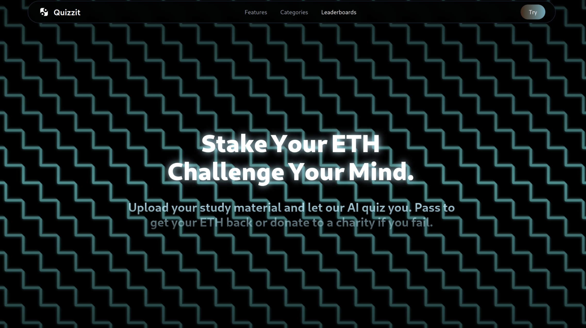
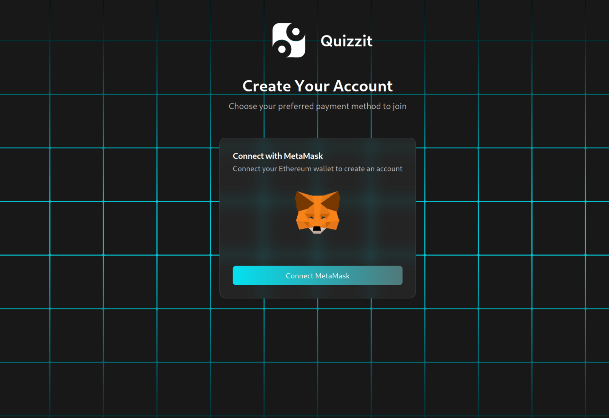
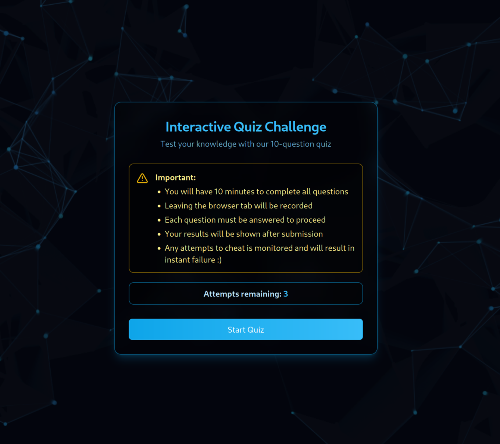
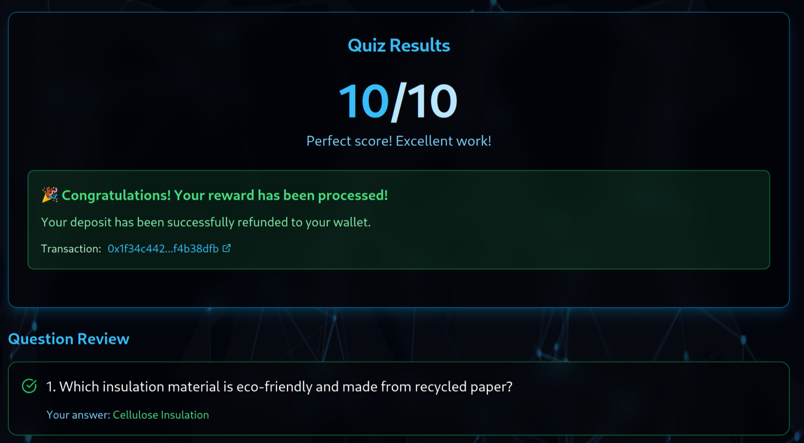
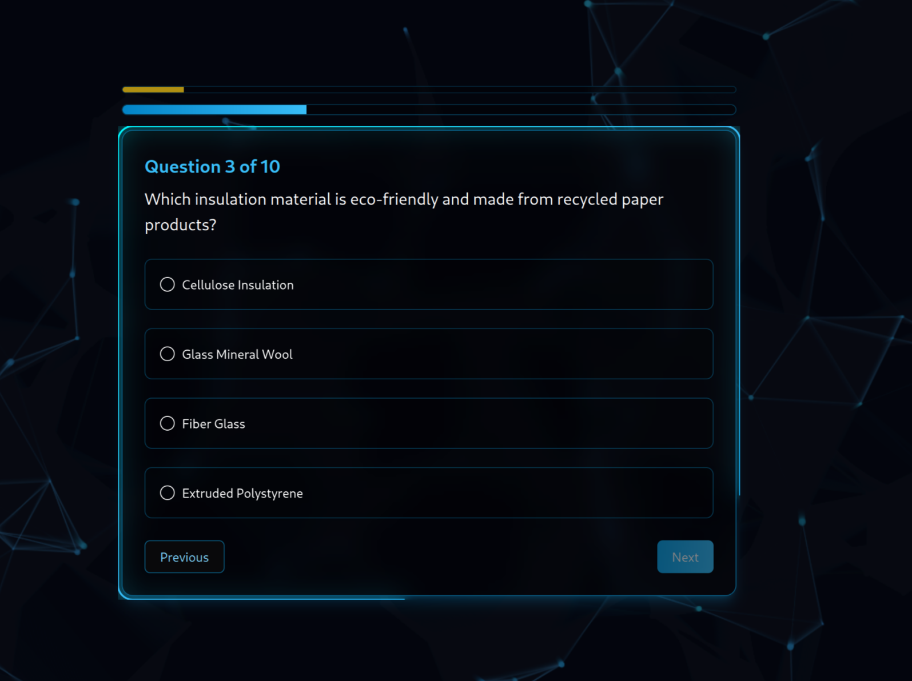

## Quizzit

### TL;DR
Users upload study material → Pay $10 → AI generates quiz → Pass (≥80% in 3 tries) → Get $10 back → Fail → $10 goes to charity

---
### Demo
  
  
  
  
  
  

## 1. **User Flow Overview**
1. **User uploads course files** (PDFs, docs, etc.)
2. **Pays $10 via Sepolia ETH** to smart contract
3. **AI parses material & generates a quiz**
4. **User takes quiz (max 3 attempts)**
5. - If score ≥ 80% → Refund $10  
   - Else → $10 sent to **donation address**

---

## 2. **Tech Stack Breakdown**
- Frontend/Backend:  `Next.js` (w/ Vercel AI SDK + Tailwind)
- DB: `MongoDB` or `Firebase`
- Smart Contract: `Solidity + Hardhat` on `Sepolia`
- File Parsing: `pdf-parse`, `mammoth`, `txt-parser`
- Quiz Logic (AI): `OpenAI / Gemini / DeepSeek / Pydantic Agent`
- Wallet & Payment: `wagmi`, `ethers.js` (integrate metamask)
- Deployment: `Vercel`

---

## 3. **MVP Build Steps**

### 1. AI Quiz Generator
- [ ] Accept user file uploads (PDFs, DOCX, TXT, etc.)
- [ ] Parse content using libraries:
  - PDF: `pdf-parse`
  - DOCX: `mammoth`
  - TXT: native parsing
- [ ] Summarize + chunk content
- [ ] Use AI (OpenAI, Gemini, etc.) to:
  - Extract key points
  - Generate 5–10 MCQ quiz questions
  - Store in DB or memory

### 2. Payment + Smart Contract (Solidity)
- [ ] Deploy contract on Sepolia:
  - Accept $10 (in ETH) deposit
  - Track: `user`, `paid`, `quiz_passed`, `tries_left`
  - If `quiz_passed == true` → allow withdrawal
  - If `tries_left == 0 && !quiz_passed` → auto-donate to fixed address
- [ ] Expose functions: `pay`, `submitQuizResult`, `refund`, `donate`

### 3. Quiz UI
- [ ] OnBoarding Tutorial
- [ ] Quiz Options Easy/Meduim/Hard
- [ ] Material or Topic Selection
- [ ] After payment confirmation, render quiz UI
- [ ] Track attempts (max 3)
- [ ] Evaluate answers in backend using API
- [ ] Send result (pass/fail) to frontend & then to contract

### 4. Web3 Integration
- [ ] Connect metamask wallet with `wagmi + RainbowKit`
- [ ] Guide user to use a facuet like google facuet to get funded wallet for sepolia
- [ ] Pay ETH to contract from wallet
- [ ] Call smart contract functions from UI
- [ ] Show remaining attempts & refund/donation status

### 5. Deployment & Live Testing
- [ ] Deploy frontend on Vercel
- [ ] Deploy smart contract on Sepolia
- [ ] Test end-to-end flow with dummy quiz + real wallet

---

## Smart Contract and Session Managment Breakdown
When user pays $10 through metamask tx hash is saved and used as Session ID
1. ON pay tx hash + Wallet address is saved in backend and backend verifies it against blockchain (is it a valid tx?) => Backend creates a session JWT from tx and address.
    - on reload and wallet reconnected address is sent again to backend then backend restores Last TX hash for this address from db then JWT is recreated to be used as SessionID 
2. Once you have SessionID and tries < 3 you are granted a quiz redirect to /quiz
3. Quiz material + Questions + Answers are saved/indexed in DB under TX hash
4. TX hash is marked as expired in DB after 3 tries then deleted
5. Smart Contract Recieves payment from frontend and tx hash/address is saved
6. Smart Contract is only controlled from backend for refund or Dontation to chairty

---

## ⏳ Timeline
| Week | Milestone                             |
|------|----------------------------------------|
| 1    | File upload + AI quiz generation + Smart contract + web3 wallet   |
| 2    | Quiz UI + Refund/Donation logic + deploy |

---

## 🚀 Bonus Ideas (if time allows)
- Site Analitics using Firebase
- Progress tracking dashboard
- Leaderboard for motivation

---

## Authors
- qOsxNj - @Justxd22 - [GitHub](https://github.com/Justxd22) / [Twitter](https://twitter.com/_xd222) / [LinkedIn](https://www.linkedin.com/in/noor-amjad-xd)
- 552uSd - @4undRaiser - [GitHub](https://github.com/) / [Twitter](https://twitter.com/) / [LinkedIn](https://www.linkedin.com/in/)
- sMieSb - @chris8811 - [GitHub](https://github.com/) / [Twitter](https://twitter.com/) / [LinkedIn](https://www.linkedin.com/in/)
- woPGuH - @Marioo - [GitHub](https://github.com/) / [Twitter](https://twitter.com/) / [LinkedIn](https://www.linkedin.com/in/)
- 0VCadD - @Cengizhan Topçu  - [GitHub]((https://github.com/CengizhanTopcu)) / [Twitter](https://x.com/ccengizhant) / [LinkedIn] https://www.linkedin.com/in/cengizhan-topcu-1a917b177/)
